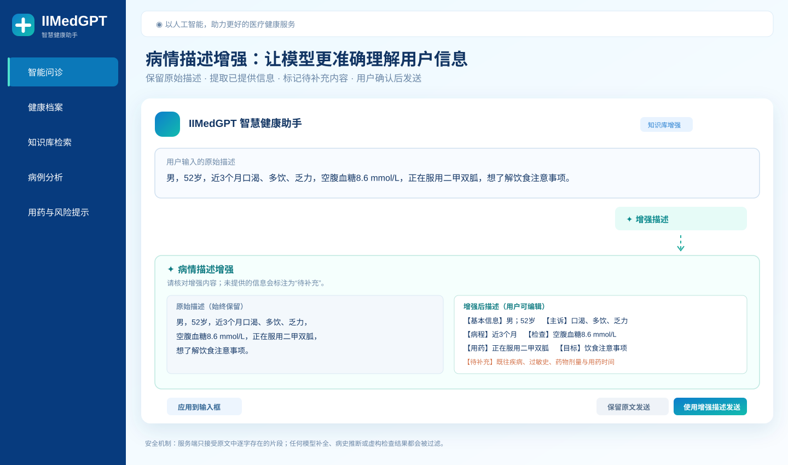
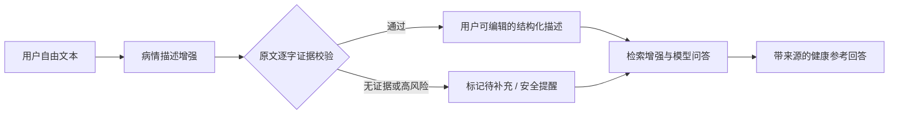
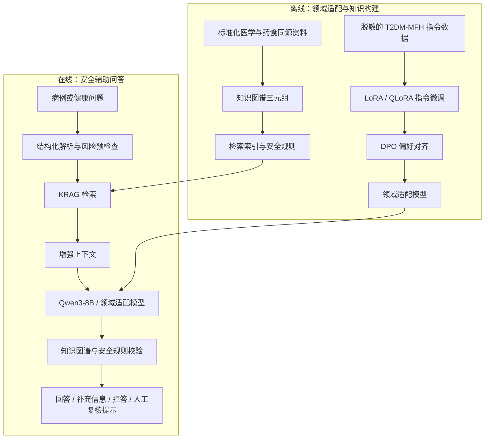

# IIMedGPT 智慧健康助手

> 面向糖尿病健康管理的医学资料检索、药食同源知识图谱与安全辅助问答系统。

[](https://3109607298.github.io/iimedgpt-health-assistant/)
[](https://github.com/3109607298/iimedgpt-health-assistant)

## 项目能力

- 智能问诊：输入症状、检查结果、用药情况或健康问题，获得结构化健康教育与安全提示。
- 病情描述增强：将自由文本整理为结构化信息，并保留原始描述供用户核对。
- 医学知识检索：联动临床指南、食养资料、匿名病例及其来源标识。
- 药食同源知识图谱：动态关联疾病、症状、材料、干预措施和安全要点。
- 健康档案与风险工具：本地记录健康指标，生成病例摘要、风险提示和用药注意事项。

## 界面实录

以下为接入本地知识库与模型服务后的实际运行界面。点击截图可进入在线展示版。

### 高血糖风险与饮食建议

<a href="https://3109607298.github.io/iimedgpt-health-assistant/"></a>

### 低血糖识别与处理

<a href="https://3109607298.github.io/iimedgpt-health-assistant/"></a>

## 病情描述增强

自由文本往往缺少病程、检查时间、用药剂量或既往史等关键信息。“增强描述”位于问诊输入框右侧，点击后会生成一份**可编辑、可核对**的结构化版本。



### 使用步骤

1. 输入病情、检查结果、正在使用的药物或希望咨询的问题。
2. 点击 **增强描述**，查看“原始描述”和“增强后描述”的对照。
3. 按需编辑结果，再选择“应用到输入框”“保留原文发送”或“使用增强描述发送”。

### 安全设计

- 原始描述始终保留，用户可随时恢复并使用原文发送。
- 模型只负责将原文信息分类；服务端只接受原文中逐字存在的片段，自动过滤虚构病史、诊断和检查结果。
- 未提供的重要字段会标记为“待补充”；识别到急症关键词时，会优先展示就医提醒。
- 增强结果只用于提高问答上下文的完整度，不构成诊断、处方或用药调整建议。



## 系统流程



## 知识库与知识图谱

项目将药食同源与 2 型糖尿病健康管理资料组织为可检索文档、来源信息与关系三元组：

| 资源 | 当前规模 | 作用 |
| --- | ---: | --- |
| 循证资料登记 | 41 条 | 为问答结果提供可追溯资料来源 |
| 知识图谱三元组 | 295 条 | 连接疾病、症状、材料、干预和风险概念 |
| 药食同源/配方资料 | 500 条 | 支持食养与安全提示类检索 |
| 匿名评估病例 | 200 条 | 支持相关病例检索与展示 |
| 服务端加载资料 | 741 条 | 供问答、检索面板和图谱联动使用 |

知识图谱用于解释资料间的关联和安全边界，不直接替代医学诊断。

## 模型训练与微调

服务端可通过 OpenAI 兼容 API 连接 Qwen3-8B，或连接已完成领域适配的 T2DM-MFH-IIMedGPT 模型服务。本仓库提供模型接入、知识库、图谱与问答界面；不包含可公开分发的医疗微调权重。

建议的领域适配路径：

1. **数据治理**：使用脱敏的问答、病例摘要、食养说明与安全拒答样本，移除身份信息、处方剂量与不可靠结论。
2. **指令微调**：训练结构化回答、资料来源提示、风险分层和补充信息追问等能力。
3. **参数高效适配**：优先采用 LoRA / QLoRA，将领域增量权重独立版本化，降低训练成本。
4. **偏好与安全对齐**：覆盖低血糖、急症、孕产期、儿童、肝肾功能异常和药物联用等场景，明确何时应建议线下就医。
5. **离线评测**：从正确性、可追溯性、安全性、拒答一致性与幻觉率等维度评估，并由医学专业人员抽检。

> 微调不能替代循证资料更新。指南、药品说明和疾病管理建议的更新，优先通过检索增强和知识图谱实现可追溯调整。

## 运行方式

| 版本 | 适用场景 | 说明 |
| --- | --- | --- |
| GitHub Pages 展示版 | 公开演示与界面体验 | 使用内置演示数据；不上传个人文件，也不暴露模型或服务器配置。 |
| 服务端部署版 | 真实模型问答 | `server.py` 连接自有模型服务，并加载本地资料、证据和知识图谱。 |

本地启动服务端版本：

```powershell
$env:QWEN_API_BASE = "http://127.0.0.1:8000/v1"
$env:QWEN_MODEL = "your-model-id"
$env:QWEN_API_KEY = "EMPTY"
python server.py
```

浏览器打开 `http://127.0.0.1:5173`。

## 使用边界

本项目仅用于健康科普、资料检索与辅助参考，不替代医疗机构或专业医生的诊断、治疗、处方和紧急医疗服务。出现意识改变、胸痛、呼吸困难、严重低血糖或其他急症症状时，请及时就医。
