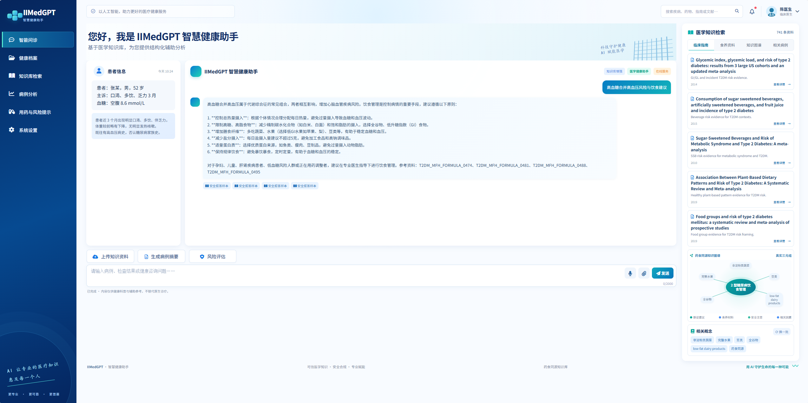
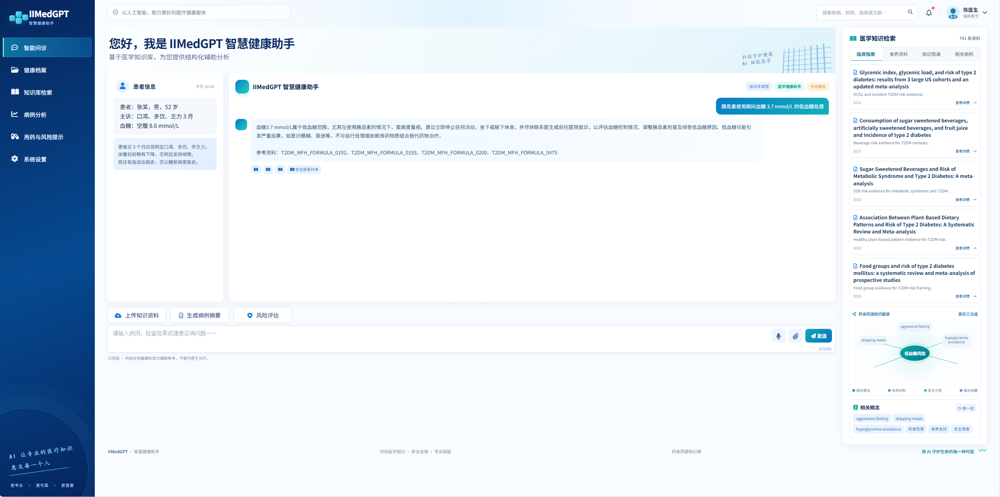
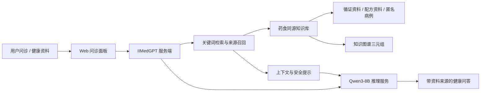

# IIMedGPT 智慧健康助手

> 面向糖尿病健康管理的药食同源知识图谱、医学资料检索与智能问答展示系统。

[](https://3109607298.github.io/iimedgpt-health-assistant/)
[](https://github.com/3109607298/iimedgpt-health-assistant)

## 界面实录

以下截图来自已接入本地知识库与 Qwen3-8B 模型服务的运行界面；点击图片可打开在线展示版。

### 高血糖风险与饮食建议

<a href="https://3109607298.github.io/iimedgpt-health-assistant/"></a>

### 低血糖识别与处理

<a href="https://3109607298.github.io/iimedgpt-health-assistant/"></a>

## 核心功能

- 智能问诊：输入症状、检查结果、用药情况或健康问题，获得结构化健康教育建议和安全提示。
- 医学知识检索：检索临床指南、食养资料、匿名相关病例，并可查看资料详情与来源标识。
- 药食同源知识图谱：动态展示疾病、症状、食养材料、干预措施和安全要点之间的关联。
- 病例分析与风险提示：从当前对话抽取主诉与风险信息，生成病例摘要、用药注意事项和就医提示。
- 健康档案：浏览器本地记录血糖、体重、血压等指标，辅助观察个人趋势。

## 系统架构



## 知识库与知识图谱

项目以药食同源与 2 型糖尿病健康管理资料为核心，服务端会将资料组织为可检索文档和关系三元组：

| 资源 | 当前规模 | 用途 |
| --- | ---: | --- |
| 循证资料登记 | 41 条 | 为检索结果提供可追溯来源 |
| 药食同源知识图谱三元组 | 295 条 | 连接疾病、症状、材料、干预和风险概念 |
| 药食同源/配方资料 | 500 条 | 支持食养与安全提示类问答 |
| 匿名评估病例 | 200 条 | 支持相关病例检索与展示 |
| 服务端加载资料 | 741 条 | 供问答、检索面板和图谱联动使用 |

图谱不直接替代医学诊断。它的作用是把检索到的资料、相关概念与安全边界可视化，帮助用户理解“为什么会给出这条建议”。

## 模型部署、训练与微调

### 当前运行方式

服务端通过 OpenAI 兼容 API 连接 Qwen3-8B 推理服务。用户问题会先经过本地资料召回，再与系统安全提示一同发送给模型生成回答；模型输出会附带命中的资料来源。

这套流程的重点是“模型 + 知识库”的协作：更新医学资料或知识图谱时，无需重新训练基础模型，即可让新资料参与问答。

### 微调建议

本仓库提供的是可运行的模型接入、知识库和问答界面，**不附带已训练的医疗微调权重**。如需训练自有版本，可采用以下路径：

1. 数据准备：将脱敏的问答、病例摘要、食养说明和安全拒答样本统一为聊天格式；去除个人身份信息、处方剂量与不可靠结论。
2. 指令微调（SFT）：以 Qwen3-8B 为基座，训练“结构化回答、来源提示、风险分层、补充信息追问”等任务格式。
3. 参数高效微调（LoRA / QLoRA）：优先采用低成本适配方案，保留基础模型通用能力，并将领域增量权重独立版本化。
4. 安全对齐：加入低血糖、急症、孕产期、儿童、肝肾功能异常和药物联用等高风险场景；明确“何时就医”与“不自行调整处方”的边界。
5. 离线评测：按正确性、资料可追溯性、安全性、拒答一致性和幻觉率评估；在上线前由医学专业人员抽检。

> 微调不能替代循证资料更新。对于指南、药品说明或疾病管理建议，更适合优先通过检索增强和知识图谱进行可追溯更新。

## 两种使用方式

| 使用方式 | 适用场景 | 说明 |
| --- | --- | --- |
| GitHub Pages 展示版 | 公开演示、界面体验 | 使用内置演示问答与知识库数据；不会上传个人文件，也不暴露模型或服务器配置。 |
| 服务端部署版 | 真实模型问答 | `server.py` 连接自有模型服务，并加载本地药食同源资料、证据和知识图谱。 |

## 本地启动服务端版本

先启动兼容 OpenAI API 的模型服务，再运行：

```powershell
$env:QWEN_API_BASE = "http://127.0.0.1:8000/v1"
$env:QWEN_MODEL = "Qwen3-8B"
$env:QWEN_API_KEY = "EMPTY"
python server.py
```

浏览器打开 `http://127.0.0.1:5173`。

## 使用边界

本项目内容仅用于健康科普、资料检索与辅助参考，不替代医疗机构或专业医生的诊断、治疗、处方和紧急医疗服务。出现意识改变、胸痛、呼吸困难、严重低血糖或其他急症症状时，请及时就医。
