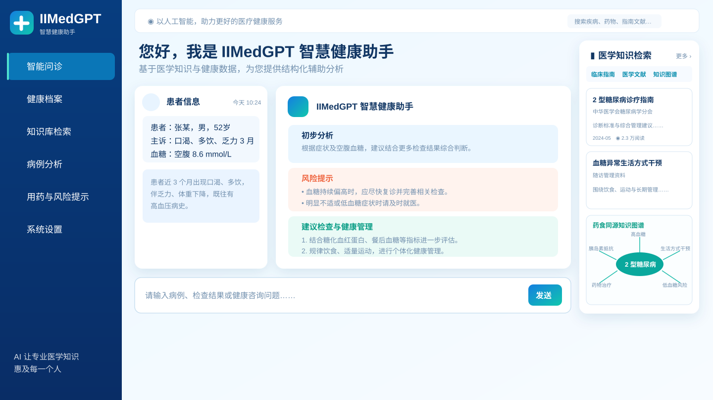

# IIMedGPT 智慧健康助手

> 药食同源知识图谱、健康问答与辅助健康管理展示站。

[](https://3109607298.github.io/iimedgpt-health-assistant/)
[](https://github.com/3109607298/iimedgpt-health-assistant)

## 界面预览

点击下方界面图或 [在线体验](https://3109607298.github.io/iimedgpt-health-assistant/) 可直接打开交互展示站。

[](https://3109607298.github.io/iimedgpt-health-assistant/)

## 功能概览

- 智能问诊：输入健康问题，获得结构化的健康教育与安全提示。
- 医学知识检索：展示临床指南、食养资料、匿名相关病例与资料详情。
- 药食同源知识图谱：根据检索内容动态关联食养材料、风险与生活方式建议。
- 病例分析与风险提示：从问诊内容生成病例摘要、风险提示和用药注意事项。
- 健康档案：可在浏览器本地记录血糖、体重、血压等健康指标。

## 两种使用方式

| 使用方式 | 适用场景 | 说明 |
| --- | --- | --- |
| GitHub Pages 展示版 | 公开演示、界面体验 | 内置演示问答与知识库数据；不上传个人文件，也不暴露模型或服务器配置。 |
| 服务端部署版 | 真实模型问答 | `server.py` 通过 OpenAI 兼容接口连接自有模型服务，并加载本地药食同源资料。 |

## 本地启动服务端版本

先启动兼容 OpenAI API 的模型服务，再运行：

```powershell
$env:QWEN_API_BASE = "http://127.0.0.1:8000/v1"
$env:QWEN_MODEL = "your-model-id"
$env:QWEN_API_KEY = "EMPTY"
python server.py
```

浏览器打开 `http://127.0.0.1:5173`。

医疗内容仅供健康科普与辅助参考，不替代专业医生的诊断、治疗或处方。
